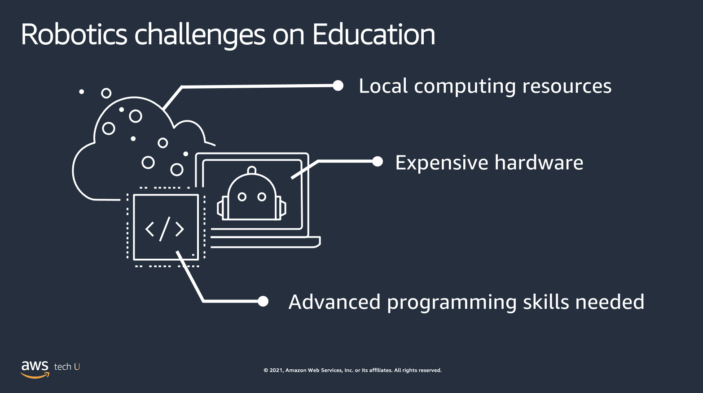
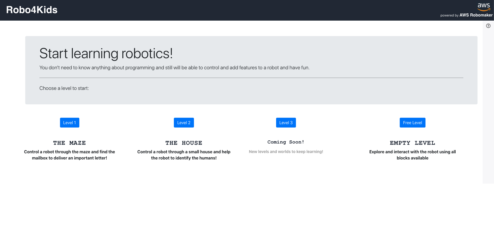
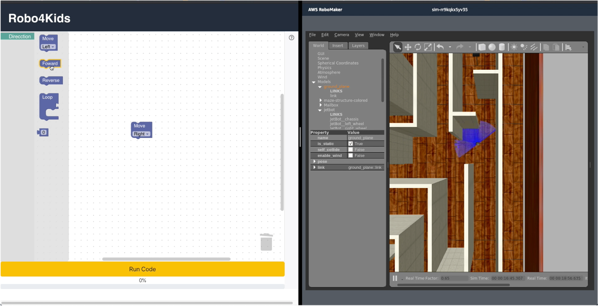

# Robo4Kids

This is a project is still a work in progress.

## About the solution

----

**Robo4Kids** is a web application built with [React Framework](https://es.reactjs.org/) working on top of [AWS RoboMaker](https://aws.amazon.com/robomaker/), using [IoT services](https://aws.amazon.com/iot/) to enable communication between the front-end, the RoboMaker Simulation and, eventually, the real robot [NVidia Jetbot](https://www.nvidia.com/en-us/autonomous-machines/embedded-systems/jetbot-ai-robot-kit) used in the simulation. Thanks to the RoboMaker capabilities it is not needed the hardware to use **Robo4Kids**, just a computer with access to internet ([clic here](https://amazon.awsapps.com/workdocs/index.html#/document/faf1348caeec016b32f416f15d9b38afa49a32ddcf0700dcdebdce9eab0b251a) to see a demostration of **Robo4Kids**).

There’s not much awareness in society about the possibilities of robotics and artificial intelligence in different fields and our daily life. Also, most schools doesn’t have robotics programs to show and teach students they can acquire the abilities to develop robotic applications and much less schools have the money to buy the hardware necessary to support those applications. This affects directly in the interest for pursuing careers in those fields of young students and the capable professionals available in the future. Also for those who may not pursue a STEM career it will be important to know how different fields can be integrated with technology to simplify or improve tasks. We identify some of the common challenges on education to implement robotics programs for students and develop Robo4Kids to overcome those challenges and give the opportunity to teach robotics at low cost and, if possible, controlling a real robot with a friendly interface.

    

The picture below shows the interface of Robo4Kids. In this menu you can select the level of the challenge you want to try:

    

It is a combination of a [Blockly](https://blockly.games/puzzle?lang=en) editor and a graphic simulation deployed in [Gazebo](http://gazebosim.org/) through AWS RoboMaker.

    

## Architecture

----

- The React app is using [AWS Amplify](https://aws.amazon.com/amplify/), allows us to integrate our backend easily and add an authentication stage using [Amazon Cognito](https://aws.amazon.com/cognito/), providing temporary credentials for the users.
- Once the user is authenticated, messages will be send to a MQTT topic in [AWS IoT Core](https://aws.amazon.com/iot-core/) to allow RoboMaker read the instruction and send it to the robot itself.
- Since the likely escenario will be using Gazebo to simulate the robot instead having the NVidia Jetbot, Gazebo will show the robot in the challenge scenario and show how the robot will move when given instructions.
- We also created a challenge using [AWS Rekognition](https://aws.amazon.com/rekognition/) to find pictures of people in a house. This was made possible thanks to RoboMaker and the [ROS](https://www.ros.org/) Cloud Extensions which allows us to integrate our application with more AWS services such as [Polly](https://aws.amazon.com/polly), [Kinesis](https://aws.amazon.com/kinesis), [CloudWatch](https://aws.amazon.com/cloudwatch/) to provide a greater user experience.
- Finally, all challenges require to know the exact position of the robot all the time to know when the challenge is completed. When the gps coordinates are inside a range defined by the challenge the user is facing, the application will show a succeded message to the user:

