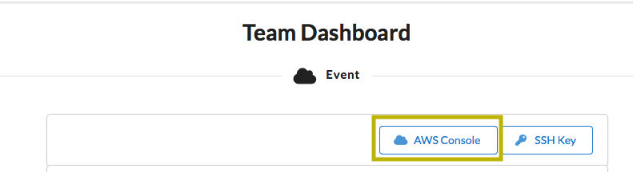
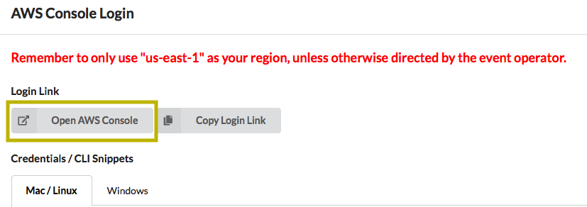
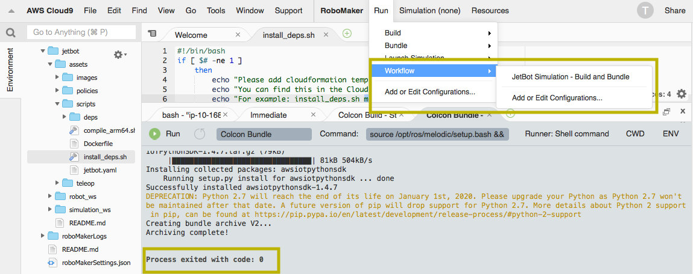
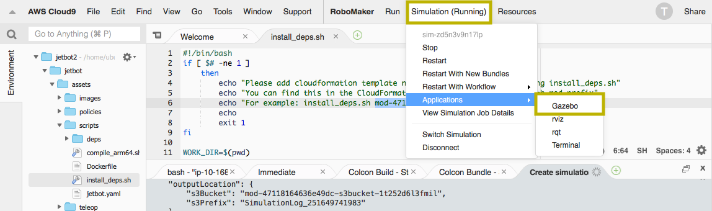
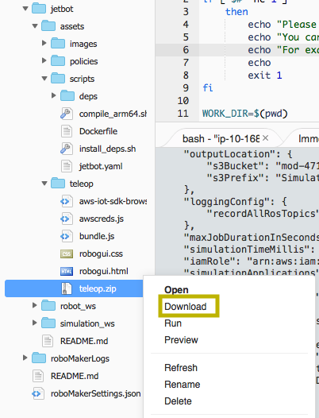
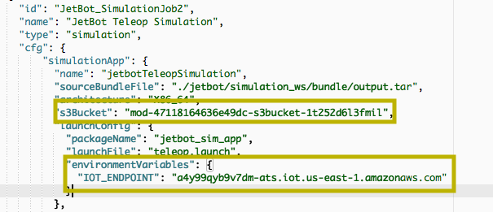
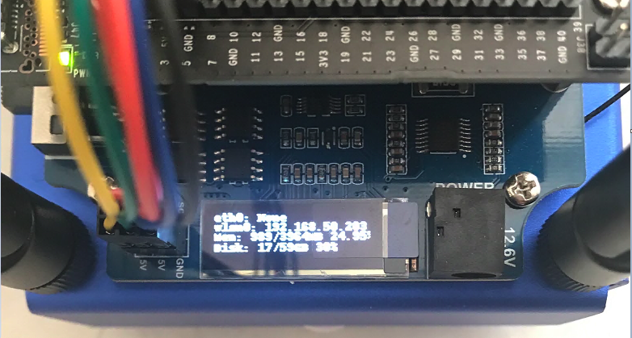
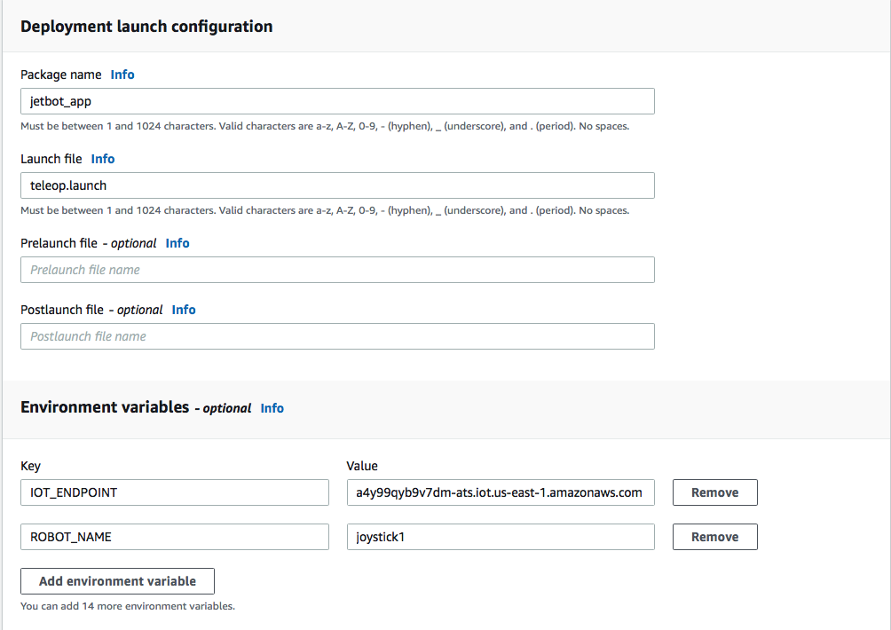

## Building a Robot Application with RoboMaker

These steps are also documented at [RoboMakerWorkshops.com](https://robomakerworkshops.com/).

## Log in to AWS Console
1. Browse to https://dashboard.eventengine.run/login, enter your assigned team hash and click "Accept Terms & Login"
1. Click on "AWS Console" then "Open AWS Console"




## Launch a CloudFormation Stack to create your environment

Ensure you are operating in US-East-1 and then [click here](https://console.aws.amazon.com/cloudformation/home#/stacks/new?templateURL=https://s3.amazonaws.com/assets.robomakerworkshops.com/cfn/bootstrap.rover.cfn.yaml&region=us-west-2).  Click "Next" to go to the "Specify Stack Details" page.  Enter a Stack name and then an s3BucketName at the bottom of the form.  Click "Next" again.  You can just accept the default stack options on the next page and click "Next" yet again.  Review your stack details and click the box at the bottom to "acknowledge that AWS CloudFormation might create IAM resources with custom names" and then finally "Create Stack."  Remember the stack name you assigned it - you will need that later.

For the purposes of this lab, you must use region US-East-1.  Please ensure you are set to that region for all steps in this lab.


## Create RoboMaker Notebook
1. Open the AWS RoboMaker console at https://console.aws.amazon.com/robomaker/
1. In the AWS RoboMaker console, select “Development environments” in the left panel and choose “Create environment”.
1. Give the environment a name, for example, RoboMaker-JetBot, select “m4.xlarge” as Instance type and choose “Create”. Any instance type can be used, however for this tutorial we recommend using an m4.xlarge instance. You can use the default VPC and subnets for this tutorial. 
1. Choose “Open environment”. It may take a few minutes for your environment to start the first time. When the creation process has completed, you will see something similar to this:


### Clone the Robot Application

1. Open the RoboMaker IDE and navigate to the terminal and clone this Git repo to the development machine:
    ```
    # change to the environment directory
    $ cd ~/environment

    $ git clone https://github.com/codingphun/aws_robomaker_jetbot_reinvent_workshop.git jetbot
    ```

### Install Dependencies [~20 mins]
1. Open the RoboMaker IDE and navigate to the terminal.

1. In the terminal window, change to the `jetbot/assets` directory 
    ```
    # Run install_dep.sh to install prerequisite
    $ cd ~/environment/jetbot/assets/scripts
    
    $ chmod +x compile_arm64.sh install_deps.sh 
    
    # Be sure to replace the placeholder below with CloudFormation name that you capture in earlier step
    $ sudo ./install_deps.sh <your CloudFormation name>
    
    ```

### Run in Simulation and Explore [~30 mins]

1. In RoboMaker IDE menu, click Run, Workflow, select JetBot Simulation - Build and Bundle  (this process takes about 10 minutes). As the name suggests, it will compile/build the ROS application and bundle it into a tar file for simulation. 

1. Make sure the Colcon Bundle tab displays "Process exited with code: 0". This indicates the build and bundle process has completed.



1. Click Run, Launch Simulation, JetBot Circle Simulation - This will launch the application in simulation enviornment with the Jetbot rotating in circles. 
2. When simulation status displays (running), explore the enviornment in Gazebo by clicking on the Simulation menu, Applications, Gazebo. Use your mouse scroll wheel to zoom in and out of the enviornment. This simple application demonstrates that you have all the components configured and installed correctly. Now you can move on to the next simulation, teleop, which allows you to remote control the JetBot. 


1. Stop the simulation from Simulation (Running) menu

1. In RoboMaker IDE menu, click Run, Launch Simulation, JetBot Teleop Simulation - This will launch the application in simulation enviornment where you can drive the Jetbot with the teleop client app. When simulation status displays (running), explore the enviornment in Gazebo by clicking on the Simulation menu, Applications, Gazebo. Use your mouse scroll wheel to zoom in and out of the enviornment. Be sure to continue with the following steps to download the joy stick client application to remote control the JetBot.

1. Locate the teleop.zip file in **jetbot/assets/teleop** folder 
1. 

1. Download the zip file in the file explorer and unzip it on the desktop
1. Open the robogui.html file in a browser and make sure the connection status states Connected
1. Use your mouse to move the joy stick and drive the Jetbot in Gazebo 
1. Stop the simulation from Simulation (Running) menu

### Build, Bundle and Deploy Robot Application in ARM64 Architecture [~20 mins]
1. Open the RoboMaker IDE and navigate to the terminal

1. Change to the **jetbot** directory and build & bundle the ROS application in a docker container. **IMPORTANT: Make sure you are in the jetbot directory** Also, if you see a permission denied error in container shell, it is safe to ignore and continue
    ```
    # Make sure you are in the jetbot directory
    $ cd ~/environment/jetbot
    
    # IMPORTANT: Make sure you are in the jetbot directory
    # Build and bundle the robot application
    $ docker run --rm -ti -v $(pwd):/environment/jetbot jetbot-ros

    # You will be dropped into the shell of the docker container
    # If you see a permission denied error, it is safe to ignore and continue

    (docker)$ ./assets/scripts/compile_arm64.sh 

    # Wait until shell script is completed 
    #Type exit or Ctrl-D, to exit the container
    (docker)$ exit
    ```
1. Open roboMakerSettings.json file located in the root folder under RoboMaker IDE folder pane. Look for s3Bucket and write down the name of the bucket, it will look similar to mod-47118164636e49dc-s3bucket-1t252d6l3fmil, you will need this for next step to upload the compiled and bundled ARM64 ROS application. Also find and write down the value in IOT_ENDPOINT, you will need it when deploying the application to the JetBot.


1. Back in the RoboMaker IDE and navigate to the terminal. Make sure you exited out of the container in previous step
    ```
    # Make sure you exited out of the container in previous step
    # Copy the robot application to S3
    $ aws s3 cp ./robot_ws/arm64_bundle/output.tar s3://<S3-BUCKET-NAME>/jetbot/aarch64/output.tar
    ```

## Deploying with RoboMaker
When a robot application is deployed to a physical robot, AWS RoboMaker does the following:

- AWS RoboMaker creates or updates a custom Lambda in your account. The Lambda contains the logic needed for deployment. This includes robot application bundle download, ROS launch, pre- and post-checks, and other logic.

- AWS RoboMaker begins deployment to the fleet using the parallelization specified in the deployment configuration.

- AWS RoboMaker notifies AWS IoT Greengrass to run the custom Lambda on the target robot. The daemon running on the robot receives the command and runs the Lambda. If a Lambda is running when the command is received, it and all ROS process on the robot are terminated.

- The Lambda downloads and uncompresses the robot application bundle from Amazon S3. If a pre-launch script was specified, it is run. Then the Lambda starts ROS using the launch file and package specified. If a post-launch script was specified, it is run after ROS is started. Finally, the status of the deployment is updated.

### Create a Robot Application
1. Open the AWS RoboMaker console at https://console.aws.amazon.com/robomaker/

1. In the left pane, choose Development, and then choose Robot applications.

1. Select **Create robot application**.

1. In the Create robot application page, type a Name for the robot application. Choose a name that helps you identify the robot.

1. Select the Robot software suite used by your robot application
    * Select *ROS Melodic*

1. Provide the Amazon S3 path to your bundled robot application file in **ARM64 source file** field. Click Browse S3 and locate the tar file that you uploaded in previous step, s3://S3-BUCKET-NAME/jetbot/aarch64/output.tar.
1. Click Create.


#### Create a Robot Application Version
1. Open the AWS RoboMaker console at https://console.aws.amazon.com/robomaker/

1. In the left navigation pane, choose Development, and then choose Robot applications.

1. Choose the robot application name.

1. In the Robot applications details page, choose Create new version, and then choose Create.

### Create a Robot

To create a robot:

1. Open the AWS RoboMaker console at https://console.aws.amazon.com/robomaker/

1. In the left navigation pane, choose Fleet Management, and then choose Robots.

1. Choose Create robot.

1. In the Create robot page, type a name for the robot.

1. Select the Architecture of the robot.

1. Select the ARM64 architecture for the JetBot

1. Under AWS IoT Greengrass group defaults, select a Create new to create a new AWS IoT Greengrass group for the robot. 
    *Optionally, you can select an existing AWS IoT Greengrass group. Each robot must have its own AWS IoT Greengrass group.*

    1. If you use an existing AWS IoT Greengrass group, it must have an IAM role associated with it. To create the role, see Create deployment role.

1. Select the existing IAM role to assign to the AWS IoT Greengrass group created for the robot. It grants permissions for AWS IoT Greengrass to access your robot application in Amazon S3 and read update status from AWS RoboMaker.

1. Choose Create.

1. In the **Download your Core device** page, choose **Download** to download and store your robot's security resources.


### Configure Robot with Certificates
AWS RoboMaker uses X.509 certificates, managed subscriptions, AWS IoT policies, and IAM policies & roles to secure the applications that run on robots in your deployment environment.

An AWS RoboMake robot is also a Greengrass core. Core devices use certificates and policies to securely connect to AWS IoT. The certificates and policies also allow AWS IoT Greengrass to deploy configuration information, Lambda functions, connectors, and managed subscriptions to core devices

1. On your local machine, open a terminal and navigate to the location of the dowloaded security resources from the previous step.

1. Locate the IP address of robot on the OLED


1. Unzip your device certificates to the robot:

    ```
    # Copy the local security resources to the robot
    $ scp /path/to/downladed-zip/<robot-certs>.zip jetbot@<ip-addres>:/home/jetbot/robomaker-robot-certs.zip

    # SSH to the robot
    $ ssh jetbot@<ip-address>

    # Switch to the root user
    $ sudo su -s /bin/bash

    # Unzip the jetbot security credentials to greengrass certificate store
    $ unzip /home/jetbot/<greengrass-certs>.zip -d /greengrass
    
    # update the CA certificate used by RoboMaker
    $ cd /greengrass/certs/
    $ wget -O root.ca.pem https://www.amazontrust.com/repository/AmazonRootCA1.pem
    
    # start greengrass core
    $ sudo /greengrass/ggc/core/greengrassd start
    
    # Exit the root shell
    $ exit # or Ctrl-d

    # Terminate the ssh connection
    $ exit # or Ctrl-d
    ```

### Create a Fleet
1. Sign in to the AWS RoboMaker

1. In the left navigation pane, under **Fleet Management**, and then choose **Fleets**.

1. Select Create fleet.

    - In the Create fleet page, type a name for the fleet.

1. Click Create to create the fleet.


#### Register a Robot

1. In the left navigation pane, choose Fleet Management, and then choose Fleets.

1. Select the Name of the fleet you want to modify.

1. In the Fleet details page and under Registered robots section, select Register new.

1. In the Register robots page, select the robot you want to register, then select Register robots.


### Create a Deployment
1. Sign in to the AWS RoboMaker console at https://console.aws.amazon.com/robomaker/

1. In the left navigation pane, choose Fleet Management, and then choose Deployments.

1. Click Create deployment.

1. In the Create deployment page, under Configuration, select a Fleet.

1. Select a Robot application.

1. Select the Robot application version to deploy. The robot application must have a numbered `applicationVersion` for consistency reasons. If there are no versions listed, or to create a new version, see Creating a Robot Application Version.

1. Under Deployment launch config, specify the Package name: `jetbot_app`

1. Specify the Launch file: `teleop.launch`
  

1. Environment variables, type in an environment Name and Value. Environment variable names must start with A-Z or underscore and consist of A-Z, 0-9 and underscore. Names beginning with “AWS” are reserved.

    - Add the following environment variables:
        - **Key** = `IOT_ENDPOINT`(key must be in all caps exactly) **Value** = `<your IoT endpointAddress>` (this is the IOT_ENDPOINT you captured from earlier step in roboMakerSettings.json file)
        - **Key** = `ROBOT_NAME`(key must be in all caps exactly) **Value** = `joystick1`(do not change the value)
                      
1. Specify a Robot deployment timeout. Deployment to an individual robot will stop if it does not complete before the amount of time specified.



1. Click Create to create the deployment job.
1. Keep track of the progress of the deployment, when copying and extracting completes, the status will change to **Launching**.  

### Drive your JetBot!
1. Open the robogui.html file in a browser and make sure the connection status states Connected
1. Use your mouse to move the joy stick and drive the Jetbot in real world!
1. Congratulations!!!
